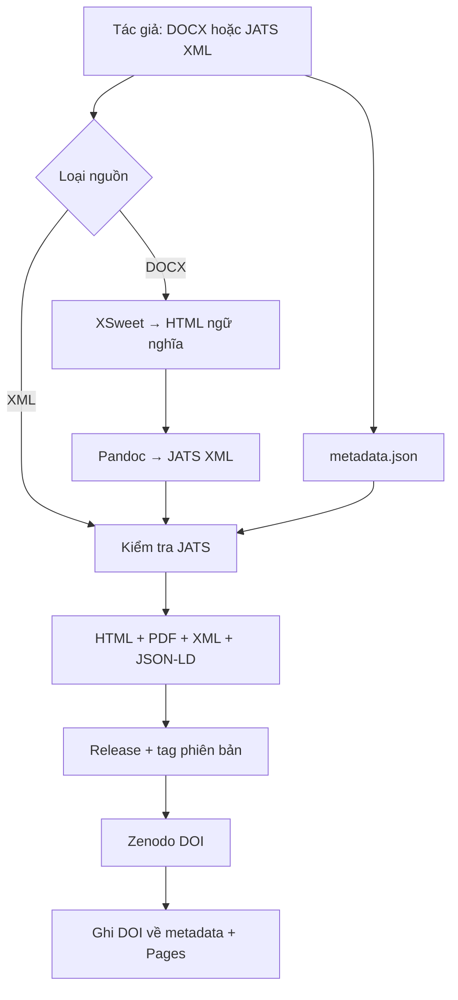

<div align="center">

**[Tiếng Việt](README.md) · [English](README.en.md) · [简体中文](README.zh-CN.md)**

  
</div>

<div align="center">

[](https://github.com/xulytiengviet/LibPub/actions/workflows/publish.yml)
[](https://github.com/xulytiengviet/LibPub/actions/workflows/validate.yml)
[](LICENSE)
[](https://jats.nlm.nih.gov/)

**LibPub biến một GitHub repository thành máy chủ xuất bản preprint tĩnh.**  
Tác giả gửi DOCX hoặc JATS XML; pipeline tự kiểm tra, sinh HTML/PDF/XML, tạo GitHub Release, lấy DOI Zenodo và deploy lên GitHub Pages.

[🌐 Trang xuất bản](https://xulytiengviet.github.io/LibPub) · [📝 Gửi bản thảo](https://xulytiengviet.github.io/LibPub/#submit) · [📖 Hướng dẫn](docs/SUBMISSION_GUIDE.md) · [🔗 Thiết lập Zenodo](docs/ZENODO_SETUP.md) · [🏗️ Kiến trúc](docs/ARCHITECTURE.md)

</div>

---

## LibPub giải quyết việc gì?

LibPub phù hợp cho kho preprint của cá nhân/nhóm nghiên cứu, báo cáo kỹ thuật, working paper, kỷ yếu quy mô nhỏ và bản thảo cần công bố nhanh có lịch sử phiên bản. Hệ thống không cần database, VPS hay CMS động:

- **GitHub repository** lưu nguồn, metadata và lịch sử thay đổi;
- **GitHub Actions** làm máy chuyển đổi, kiểm tra và dàn trang;
- **GitHub Pages** phân phối website tĩnh;
- **XSweet** làm sạch DOCX thành HTML ngữ nghĩa;
- **Pandoc** nối HTML với JATS XML và sinh PDF;
- **JATS XML** giữ nguồn máy đọc được, sẵn sàng trao đổi với hệ thống xuất bản khác.

> [!IMPORTANT]
> XSweet chuyển DOCX thành HTML ngữ nghĩa, không trực tiếp tạo JATS XML. LibPub dùng chuỗi đúng bản chất: **DOCX → XSweet HTML → Pandoc JATS XML**. Nếu dịch vụ XSweet không khởi động được, pipeline dùng Pandoc trực tiếp và ghi cảnh báo rõ trong log.

## Luồng xuất bản



Mỗi commit là một dấu mốc có thể kiểm tra. Với DOCX, `article.xml` sinh ra được commit trở lại repository bằng tài khoản `github-actions[bot]`. Mỗi phiên bản đã duyệt nhận tag dạng `v<version>.0-<slug>`, một GitHub Release có PDF/XML/metadata và—khi Zenodo đã được bật—một DOI được ghi tự động về bài báo.

## Bắt đầu trong 5 phút

### 1. Bật GitHub Pages một lần

Vào **Settings → Pages → Build and deployment → Source**, chọn **GitHub Actions**. Workflow chỉ deploy được sau khi Pages dùng nguồn GitHub Actions.

### 2. Bật quyền workflow và Zenodo một lần

1. Vào **Settings → Actions → General → Workflow permissions**, chọn **Read and write permissions**.
2. Mở [thiết lập Zenodo cho LibPub](https://zenodo.org/account/settings/github/repository/xulytiengviet/LibPub), kết nối GitHub nếu cần và bật repository.
3. Giữ `zenodo.mode` là `github-release` trong `publication.config.json`. Chế độ mặc định không cần secret Zenodo.

Hướng dẫn đầy đủ và chế độ REST API tùy chọn: [`docs/ZENODO_SETUP.md`](docs/ZENODO_SETUP.md).

### 3. Chọn một trong hai cách gửi

#### Cách A — Dashboard “Submit & Publish”

1. Mở `https://xulytiengviet.github.io/LibPub/#submit`.
2. Điền tiêu đề, tóm tắt, từ khóa, tác giả, DOI nếu đã được cấp.
3. Chọn `manuscript.docx` hoặc `article.xml`.
4. Nhập fine-grained personal access token có quyền **Contents: Read and write** cho riêng repo `LibPub`.
5. Bấm **Submit & Publish**.

Dashboard dùng Git Data API để tạo **một commit nguyên tử** gồm `metadata.json` và bản thảo, rồi cập nhật nhánh `main`. Token chỉ nằm trong RAM của tab, không được ghi vào storage, cookie, URL hoặc source code.

> [!CAUTION]
> Chế độ này dành cho chủ repository hoặc tác giả được ủy quyền. Với cổng nhận bài công cộng, hãy tắt `directPublishEnabled` và dùng pull request/issue hoặc một backend xác thực riêng.

#### Cách B — Gửi bằng Git/pull request

Tạo thư mục mới:

```text
articles/ten-bai-bao/
├── metadata.json
└── manuscript.docx      # hoặc article.xml
```

Sau đó commit và push:

```bash
git add articles/ten-bai-bao
git commit -m "publish: ten-bai-bao v1"
git push
```

Pull request sẽ chạy workflow **Validate submission** nhưng không deploy. Merge vào `main` sẽ chạy workflow **Publish LibPub**.

## Metadata tối thiểu

```json
{
  "schemaVersion": "1.0",
  "slug": "ten-bai-bao",
  "title": "Tiêu đề đầy đủ của bài báo",
  "abstract": "Tóm tắt tối thiểu 20 ký tự.",
  "keywords": ["JATS XML", "preprint"],
  "language": "vi",
  "articleType": "research-article",
  "status": "preprint",
  "version": 1,
  "autoDoi": true,
  "doi": "10.1234/libpub.2026.001",
  "publishedDate": "2026-08-04",
  "license": {
    "id": "CC-BY-4.0",
    "url": "https://creativecommons.org/licenses/by/4.0/"
  },
  "authors": [
    {
      "given": "Long",
      "family": "Ngo",
      "orcid": "",
      "email": "",
      "corresponding": true,
      "affiliations": ["aff1"]
    }
  ],
  "affiliations": [
    { "id": "aff1", "name": "Tên cơ quan", "city": "Vĩnh Long", "country": "Vietnam" }
  ]
}
```

Schema đầy đủ: [`schemas/metadata.schema.json`](schemas/metadata.schema.json). Bài mẫu có thể chạy ngay: [`articles/demo-libpub`](articles/demo-libpub).

## DOI tự động qua Zenodo

- Nếu `doi` để trống, merge vào `main` sẽ dựng bài, tạo tag/Release, rồi workflow **Zenodo DOI Sync** chờ Zenodo cấp DOI và ghi DOI cùng URL bản ghi trở lại `metadata.json`.
- Có thể đặt `autoDoi: false` cho bài mẫu hoặc bản nháp không được phép tạo Release/DOI.
- Nếu `doi` đã có, LibPub chỉ kiểm tra cú pháp và hiển thị DOI đó; hệ thống không tạo thêm bản ghi Zenodo.
- Mỗi phiên bản khoa học phải tăng `version`. Tag mặc định là `v<version>.0-<slug>` và không được ghi đè.
- Tích hợp GitHub của Zenodo có thể cần vài phút để xử lý. Workflow đồng bộ có thể chạy lại thủ công với đúng `slug` và `tag` nếu hết thời gian chờ.

Chi tiết: [thiết lập Zenodo](docs/ZENODO_SETUP.md) và [DOI & quản lý phiên bản](docs/DOI_AND_VERSIONING.md).

## Sản phẩm của mỗi bài

| Sản phẩm | Đường dẫn | Mục đích |
|---|---|---|
| Trang đọc HTML | `output/articles/<slug>/index.html` | Đọc trên web, SEO, JSON-LD/Highwire meta |
| PDF | `output/articles/<slug>/article.pdf` | Release asset, tải xuống và trích dẫn |
| JATS XML | `output/articles/<slug>/article.xml` | Máy đọc, trao đổi, tái xuất bản |
| Metadata | `output/articles/<slug>/metadata.json` | Bản mô tả LibPub có DOI/Zenodo |
| Zenodo metadata | `output/articles/<slug>/zenodo.json` | Metadata cho release/tag hiện hành |
| Chỉ mục/feed | `output/articles.json`, `feed.xml` | Dashboard và theo dõi công bố |

## Chạy cục bộ

Yêu cầu: Python 3.12+, `lxml`, Pandoc và XeLaTeX nếu cần PDF.

```bash
python -m pip install -r requirements.txt
python scripts/prepare_sources.py --write-back
python -m unittest discover -s tests -v
python scripts/build.py --output output
python -m http.server 8000 --directory output
```

Mở `http://localhost:8000`. Có thể dùng `make build`, `make test`, `make serve` trên Linux/macOS.

### Dùng XSweet cục bộ

```bash
docker build -t libpub-xsweet tools/xsweet
docker run --rm -p 127.0.0.1:8081:80 libpub-xsweet
LIBPUB_XSWEET_URL=http://127.0.0.1:8081/ python scripts/prepare_sources.py --write-back --force
```

## Cấu trúc repository

```text
LibPub/
├── .github/workflows/       # validate, build, deploy Pages
├── articles/                # nguồn từng bài báo
├── assets/                  # dashboard và kiểu dàn trang
├── docs/                    # hướng dẫn vận hành
├── schemas/                 # JSON Schema metadata
├── scripts/                 # chuẩn bị, kiểm tra, build
├── templates/               # mẫu trang bài báo
├── tests/                   # kiểm thử tích hợp
├── tools/xsweet/            # dịch vụ XSweet/Saxon tham chiếu
├── index.html               # Author & publication dashboard
└── publication.config.json  # tên, URL, repo và chính sách
```

## Cấu hình cho fork hoặc tạp chí khác

Sửa `publication.config.json`:

```json
{
  "name": "Tên kho xuất bản",
  "publisher": "Tên tổ chức",
  "repository": "owner/repository",
  "defaultBranch": "main",
  "baseUrl": "https://owner.github.io/repository",
  "directPublishEnabled": true,
  "languages": ["vi", "en", "zh"],
  "zenodo": {
    "enabled": true,
    "autoDoi": true,
    "mode": "github-release",
    "apiUrl": "https://zenodo.org"
  }
}
```

Đổi `directPublishEnabled` thành `false` nếu chỉ nhận pull request. Sau khi đổi `baseUrl`, chạy lại workflow để cập nhật URL tuyệt đối trong JSON-LD, sitemap, feed và chỉ mục bài báo.

## Giới hạn có chủ đích

- GitHub Pages là hosting tĩnh; không có đăng nhập máy chủ, database hoặc secret an toàn trong frontend.
- Dashboard không thể nhận bài công cộng mà không có xác thực. Fine-grained token là ủy quyền của chính người dùng.
- LibPub tự động hóa việc lưu trữ Zenodo/DOI nhưng không thay thế bình duyệt, kiểm tra đạo văn, CLOCKSS/LOCKSS hoặc lưu chiểu pháp định.
- XSweet service tham chiếu dùng nền tảng PHP/Saxon cũ; pipeline có fallback Pandoc để tránh khóa toàn bộ xuất bản. Trước khi dùng sản xuất quy mô lớn, nên pin/cập nhật image và vendor stylesheet đã kiểm định.
- PDF bằng Pandoc/XeLaTeX ưu tiên khả năng tái lập; tài liệu có bố cục đặc biệt có thể cần template TeX riêng.

## Nguồn cảm hứng và giấy phép

Thiết kế lấy cảm hứng từ [Libero Publisher](https://github.com/libero/publisher) về hạ tầng xuất bản mở và mô-đun; dùng chuỗi XSweet/HTMLevator từ gói tham chiếu đính kèm. Chi tiết ghi nhận nằm trong [ATTRIBUTION.md](ATTRIBUTION.md).

Mã LibPub phát hành theo [MIT License](LICENSE). Nội dung bài báo giữ giấy phép do từng `metadata.json` khai báo.

---

<div align="center">
  <strong>LibPub</strong> · Open infrastructure for open knowledge · Phát triển bởi Long Ngo
</div>
