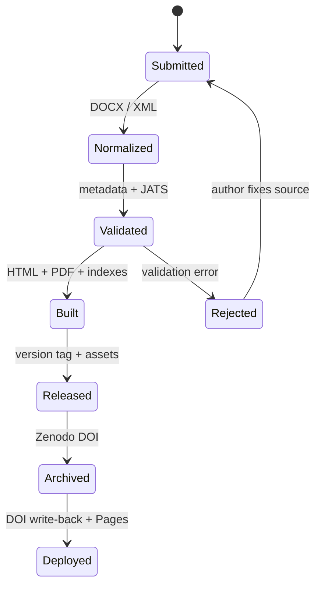

# Kiến trúc LibPub

## Nguyên tắc

LibPub tách năm lớp: nguồn học thuật, chuẩn hóa, trình bày, phát hành và phân phối. Repository là nguồn sự thật; `output/` chỉ là sản phẩm có thể tái tạo.

| Lớp | Thành phần | Trách nhiệm |
|---|---|---|
| Nguồn | `articles/<slug>` | DOCX/JATS và metadata khai báo |
| Chuẩn hóa | XSweet, Pandoc, `prepare_sources.py` | DOCX → HTML → JATS; đồng bộ front matter |
| Kiểm tra | `libpub.py`, schema, tests | slug, DOI, ORCID, ngày, giấy phép, XML |
| Dàn trang | `build.py`, template, XeLaTeX | HTML, PDF, JSON-LD, Highwire meta |
| Phát hành | GitHub Release, `.zenodo.json`, `zenodo.py` | tag bất biến, release assets, DOI Zenodo |
| Phân phối | GitHub Actions, Pages artifact | deploy website tĩnh có DOI |

## Trạng thái dữ liệu

## Hai đường nộp bài

Dashboard chạy hoàn toàn phía trình duyệt. Với quyền của người dùng, nó gọi Git Data API theo chuỗi:

1. đọc ref và parent commit hiện hành;
2. tạo blob metadata và blob bản thảo;
3. tạo tree dựa trên base tree;
4. tạo commit có đúng một parent;
5. fast-forward ref, không dùng force.

Đường pull request dùng workflow read-only `validate.yml`; không có quyền deploy hoặc ghi vào repository.

## DOCX và XSweet

Container `tools/xsweet` tái cấu trúc dịch vụ PHP/Saxon từ gói tham chiếu. Khi container sẵn sàng, `prepare_sources.py` POST DOCX tới XSweet, nhận HTML, rồi dùng Pandoc sinh JATS. Nếu XSweet lỗi, script chuyển DOCX trực tiếp bằng Pandoc và đưa cảnh báo vào `.libpub/preparation.json`.

## Ranh giới bảo mật

- Secret không nằm trong Pages artifact.
- Dashboard không giữ token sau phiên và không có OAuth client secret.
- Workflow chính có `contents: write` chỉ để lưu JATS sinh ra; deploy job chỉ có `pages: write` và `id-token: write`.
- Pull request từ fork không được phép ghi hoặc deploy.
- XML parser tắt network và external entity resolution.

## Hai chế độ Zenodo

`github-release` là chế độ mặc định: Release kích hoạt tích hợp GitHub của Zenodo, sau đó workflow công khai tra DOI qua Records API. Mỗi tag có một commit lưu trữ riêng chứa `.zenodo.json`, nên Zenodo nhận đúng metadata của bài thay vì metadata cấp repository.

`api` dùng `ZENODO_ACCESS_TOKEN` trong GitHub Actions để tạo deposition, tải PDF/XML/JSON và publish trực tiếp. Chỉ bật một chế độ; nếu dùng `api`, hãy tắt repository trong trang GitHub integration của Zenodo để tránh hai bản ghi cho cùng phiên bản.

## Khả năng mở rộng

LibPub có thể bổ sung Crossref/DataCite deposit, BagIt/RO-Crate, kiểm tra JATS DTD chính thức, template PDF theo tạp chí hoặc lớp bình duyệt. Các tích hợp có secret phải chạy trong GitHub Actions/ứng dụng backend, không đặt trong `index.html`.
